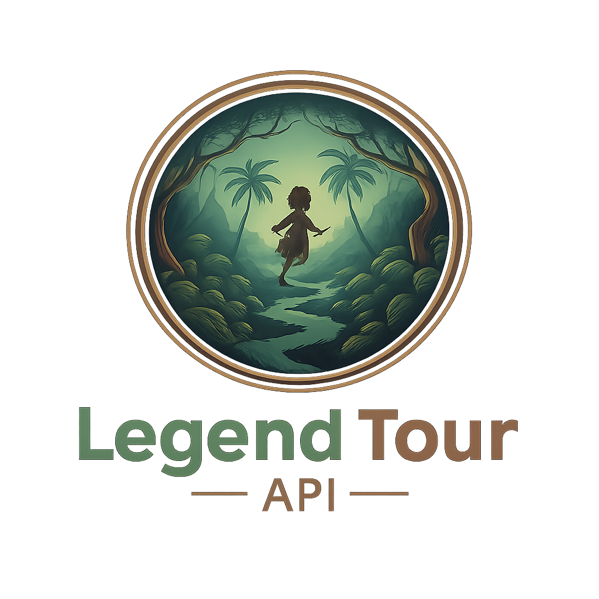

<p align="center">
  
</p>

Legen Tour es un backend diseñado para promover el turismo cultural y místico en Colombia, mostrando cómo la historia, los mitos y las leyendas se entrelazan con lugares reales que hoy pueden visitarse.
permite ubicar la región donde ocurrió el suceso, Mostrar hoteles, restaurantes y sitios turísticos cercanos. Así mismo los usuarios pueden leer reseñas públicas sin registrarse, dar la opción a usuarios registrados de dejar sus reseñas o crear su propia leyenda o historia vivida en estos lugares.

Este backend en NestJS gestiona de regiones, leyendas, lugares de evento, hoteles, restaurantes, historias míticas y usuarios con autenticación JWT.

## Problema

El turismo en Colombia se ha concentrado principalmente en la promoción comercial de destinos, priorizando la venta de paquetes y las calificaciones generales de los lugares. Sin embargo, este enfoque deja de lado el valor cultural, histórico y mágico que caracteriza a muchas regiones del país.

## Propuesta de valor
En Legen Tour API no solo visitas un lugar, lo vives a través de su leyenda.”

- Fomenta el turismo cultural, histórico y paranormal.
- Preserva la tradición oral y el patrimonio mítico colombiano.
- Ofrece información real y dinámica (lugares, reseñas, hoteles, restaurantes).
- Permite a los usuarios crear sus propias historias inspiradas en experiencias reales.

## Funcionalidad
| **Actividad**                                                           | **Descripción**                                                           |
| ------------------------------------------------------------------- | --------------------------------------------------------------------- |
| 1. Mostrar leyendas y mitos de Colombia                         | Cada mito incluye su historia, región y descripción.                  |
| 2. Ubicar la región del suceso                                  | Se muestran mapas y coordenadas del evento.                           |
| 3. Mostrar hoteles, restaurantes y sitios paranormales cercanos | Relacionados con la leyenda o la zona donde ocurrió el suceso.        |
| 4. Sistema de reseñas públicas                                  | Cualquier visitante puede ver reseñas y opiniones sin iniciar sesión. |
| 5. Creación de reseñas y experiencias                           | Solo usuarios autenticados pueden dejar su reseña.                    |
| 6. Creación de historias personales (mini leyendas)            | Los usuarios pueden compartir su propia experiencia mítica.           |
| 7. Panel de administrador                            | Permite gestionar leyendas, lugares y contenidos. 

## ¿Qué nos diferencia?

Legen Tour API no es una plataforma turística tradicional:

- Inicia por la leyenda, no por el destino, ofreciendo un enfoque cultural y narrativo único.
- Conecta historia y turismo, mostrando hoteles, restaurantes y lugares reales asociados a cada mito.
- Incluye eventos paranormales reportados, ampliando la experiencia hacia el turismo alternativo.
- Permite que usuarios autenticados creen sus propias historias o leyendas.
- Preserva el patrimonio oral colombiano, integrando tecnología con tradición cultural.

## Tecnologías

- Node.js / TypeScript
- NestJS
- TypeORM (PostgreSQL)
- Passport JWT / Local
- Swagger (documentación automática)

## Requisitos

- Node.js 18+
- PostgreSQL 13+
- npm 9+

## Instalación

```bash
npm install
```

## Variables de entorno

Crea un archivo `.env` en la raíz con:

```env
DB_HOST=localhost
DB_PORT=5432
DB_USER=postgres
DB_PASSWORD=postgres
DB_NAME=legend_tour
JWT_SECRET=secret_key_dev
PORT=3002
```

## Scripts

```bash
npm run start        # desarrollo
npm run start:dev    # watch mode
npm run start:prod   # producción (usa dist/)
npm run build        # compila TypeScript
npm run test         # tests unitarios
npm run test:e2e     # tests e2e
npm run test:cov     # cobertura
```

## Documentación API

Luego de iniciar el servidor visita:

```text
http://localhost:3002/api
```

Allí encontrarás Swagger con los endpoints disponibles.

## Seed de base de datos

Para poblar datos de ejemplo:

- Endpoint: `POST /seed`
- Devuelve conteo de registros creados.

## Autenticación

- Registro: `POST /auth/register`
- Login: `POST /auth/login`
- Refresh: `POST /auth/refresh`
- Cambio de contraseña: `POST /auth/change-password`
- Restablecer contraseña: `POST /auth/reset-password`
- Roles: usar decorador `@Admin()` o `@Roles('admin')`.

Guards:

- `JwtAuthGuard`: protege endpoints privados.
- `LocalAuthGuard`: login con estrategia local.
- `RolesGuard`, `AdminGuard`: autorización por rol.

## Estructura principal

```text
src/
  auth/
  users/
  regions/
  legends/
  event-places/
  hotels/
  restaurants/
  reviews/
  myth-stories/
  credentials/
  database/
```

## Docker (opcional)

Si existe `docker-compose.yml`:

```bash
docker compose up -d
```

Asegúrate de que las variables coincidan con tu `.env`.

## Tests

```bash
npm run test
npm run test:e2e
```

## Buenas prácticas

- Usa DTOs con validaciones (`class-validator`).
- Activa `ValidationPipe` (ya configurado en `main.ts`).
- No expongas `JWT_SECRET` público.

## Contribución

1. Crea rama feature: `git checkout -b feature/nueva-funcionalidad`
2. Agrega tests y documentación.
3. Haz PR y describe cambios.

## Authors

- [@cifuentesrubiela](https://www.github.com/octokatherine)
- [@isabel2017rosa-hub](https://www.github.com/octokatherine)
- [@Loren4mel](https://www.github.com/octokatherine)
- [@Maleja-ortiz12](https://www.github.com/octokatherine)
- [@sindysuarez1](https://www.github.com/octokatherine)
